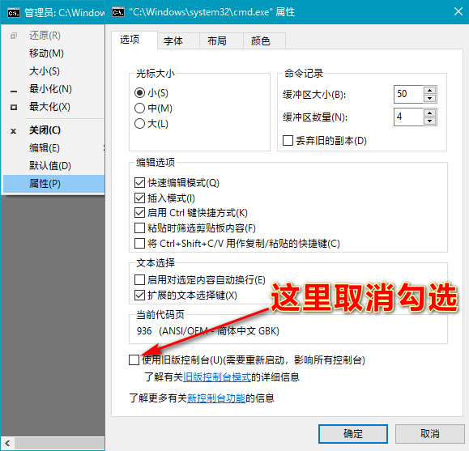
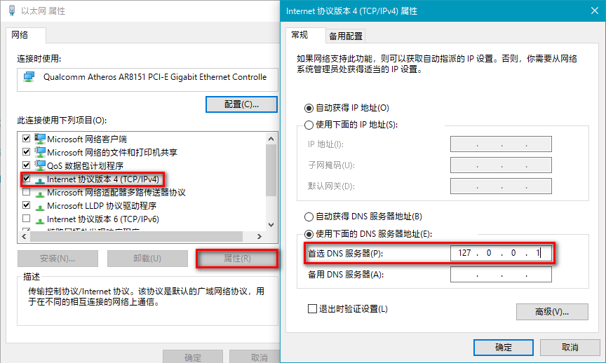

# smartdns4win

[原项目smartdns](https://github.com/pymumu/smartdns)

## 使用说明

### 启用WSL

Win10需要用linux子系统WSL支持，WSL的开启方法如下:
`PowerShell` 下执行以下命令开启WSL功能:

```bash
Enable-WindowsOptionalFeature -Online -FeatureName Microsoft-Windows-Subsystem-Linux /all
```

普通命令行cmd下执行:
```bash
dism.exe /online /enable-feature /featurename:Microsoft-Windows-Subsystem-Linux /all /norestart
```
如果你像我一样用的是精简过的Win10系统的话，上面的命令会出错，需要用到[功能恢复包](https://moeclub.org/2018/11/27/704/?spm=35.5)，我下面度盘提供了1809和1903两个版本的功能恢复包，自行选择即可。功能恢复包使用后需要重启才能生效。

参考下图的操作修改一下cmd的属性，不然安装WSL子系统实例会出错



参考微软官方《[手动下载适用于 Linux 的 Windows 子系统发行版包](https://docs.microsoft.com/zh-cn/windows/wsl/install-manual)》下载Debian包，修改文件类型为 `*.zip`，解压至你想要安装的路径，比如: `D:\Program Files\Debian`，执行`debian.exe`安装，按需设置新用户名称和密码...

### 安装smartdns

将我分享的smartdns压缩包解压至**不含空格的路径**中，比如: `D:\Tools\smartdns`

从[原项目的Release](https://github.com/pymumu/smartdns/releases)下载Debian适用的包：`smartdns.1.***.x86_64-debian-all.deb`，放入上面的目录中

管理员权限执行批处理文件 `init.bat`，中间有停顿需要输入上面刚刚新建的用户密码，一路回车即可

手动设置本地连接的首选dns为 `127.0.0.1`。



打开命令行窗口测试一下，`nslookup www.google.com`，出现类似下面的结果就说明成功了！

```bash
C:\>nslookup www.google.com
服务器:  localdomain
Address:  127.0.0.1

非权威应答:
DNS request timed out.
    timeout was 2 seconds.
名称:    www.google.com
Address:  69.63.184.14
```

**工具包度盘链接**: https://pan.baidu.com/s/1_WakgCRpOjahlw760igYNg 提取码: 2333

###感谢: 
GitHub用户 [rufengsuixing](https://github.com/rufengsuixing)? 提供的[Win10一键安装脚本](https://github.com/pymumu/smartdns/issues/107)
