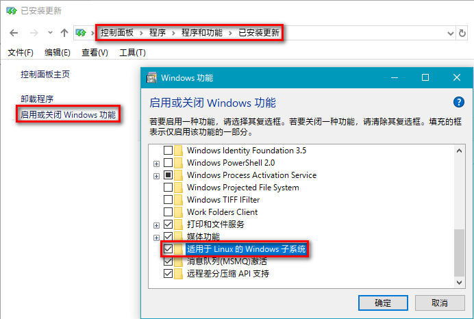
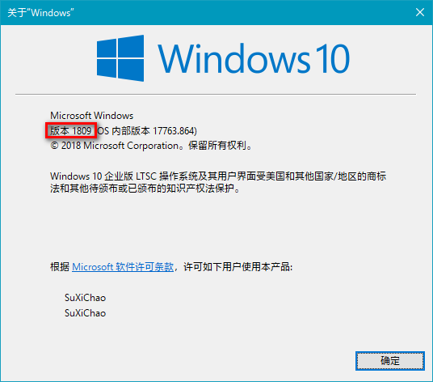
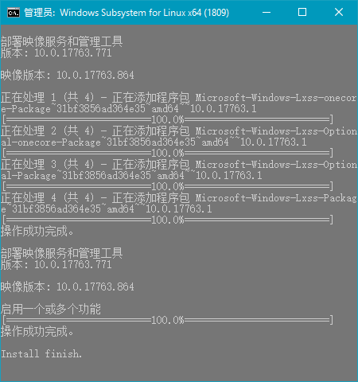
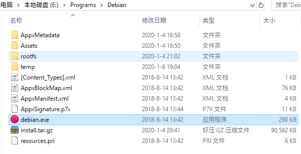
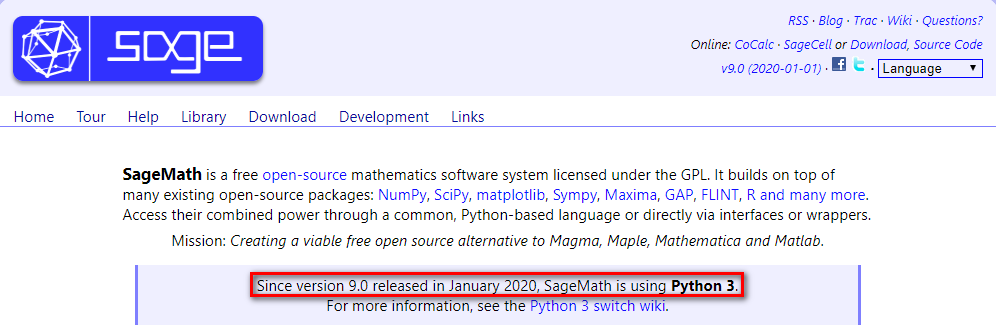
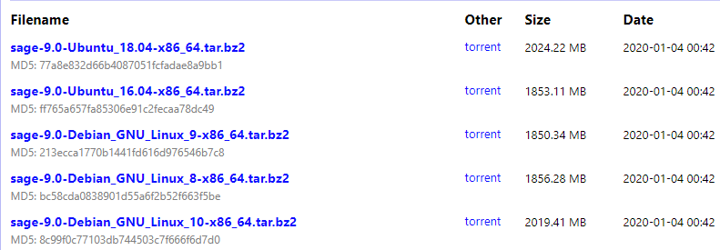
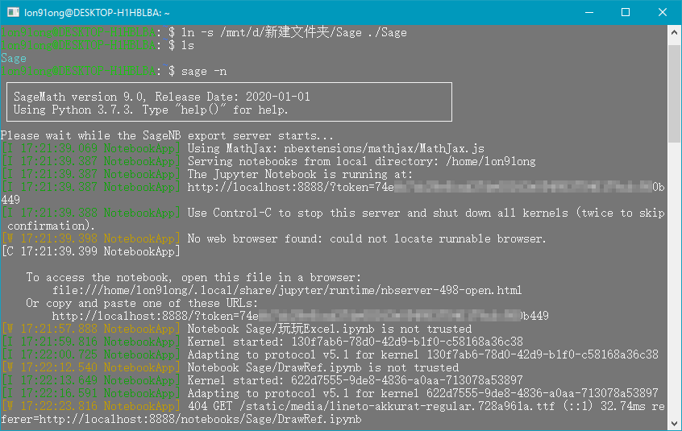
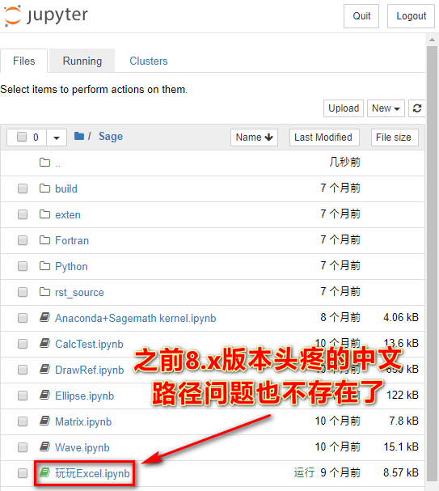
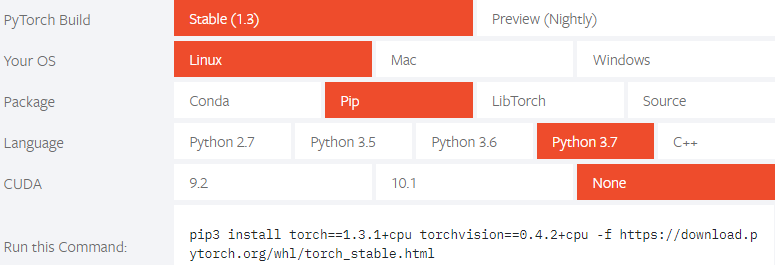

# Win10下WSL中折腾SageMath

**所有用到的工具** ：
[百度分享](https://pan.baidu.com/s/1_WakgCRpOjahlw760igYNg)， 密码：2333

## WSL的安装

官方完整版的Win10系统启用WSL功能的两种方法:

### 控制面板方法



### 命令行方法

命令行方法分两种，都需要管理员权限执行：

#### Powershell命令

``` bash
Enable-WindowsOptionalFeature -Online -FeatureName Microsoft-Windows-Subsystem-Linux /all
```

#### CMD命令

``` bash
dism.exe /online /enable-feature /featurename:Microsoft-Windows-Subsystem-Linux /all /norestart
```

大多数精简过的Win10系统都把WSL功能去掉了，需要使用功能恢复包，页首的百度网盘分享包含了1809和1903两个版本win10的WSL功能恢复包

通过 **运行** -- winver 查看Win10版本:



选择对应的功能恢复包，管理员权限运行:



完成后重新启动即可。

## Debian安装

参考《[手动下载适用于 Linux 的 Windows子系统发行版包](https://docs.microsoft.com/zh-cn/windows/wsl/install-manual)》的说明，下载官方Debian9的包， 或者页首的百度网盘中有自制的Debian10包。

下载后解压至 **无空格** 目录，这里以 E:\\Programs 为例，



直接运行 Debian.exe 即可安装完成。

## SageMath安装

### 默认的安装方式(8.6)

#### apt-get方式

``` bash
sudo apt-get install sagemath
```

#### deb方式

[SageMath的deb包下载](https://pkgs.org/download/sagemath)选择适合的包下载，我这里选的是 Debian 10(Buster) 适用的
sagemath\_8.6-6\_amd64.deb

```bash
sudo apt-get install gdebi  #可选，为了省去'环境依赖'引起的麻烦
sudo dpkg -i PackageName.deb #没有装gdebi的条件下这样装deb包
sudo gdebi PackageName.deb  #装了gdebi后这样装deb包
```

### 安装SageMath 9.0的方法

SageMath9.0终于投入了Python3的怀抱



SageMath9.0下载：



这里选择：
[sage-9.0-Debian\_GNU\_Linux\_10-x86\_64.tar.bz2](https://mirrors.tuna.tsinghua.edu.cn/sagemath/linux/64bit/sage-9.0-Debian_GNU_Linux_10-x86_64.tar.bz2)

下载完解压(压缩包2G，解压后7G+)，初始化，修改环境变量PATH：

```bash
# 解压
sudo tar jxvf /mnt/e/下载/sage-9.0-Debian_GNU_Linux_10-x86_64.tar.bz2 -C /mnt/e/Programs 
...
# 初始化
sudo bash /mnt/e/Programs/SageMath/sage
...
# 添加环境变量 或 添加软连接
echo 'export PATH="$PATH:/mnt/e/Programs/SageMath/"' >> /home/$USER/.bashrc
sudo ln -s /mnt/e/Programs/SageMath/sage /usr/bin/sage
```

之后重启WSL就可以用 sage -n 来启动 notebook 服务了，依旧是访问`http://localhost:8888/tree`打开熟悉的Jupyter界面。





## SageMath使用笔记

后台方式运行 notebook 服务:

> nohup sage -n \> notebook.log 2\>&1 &

使用 jupyterlab :
```bash
#安装
sage --pip install jupyterlab
#启动
sage -n jupyterlab
#后台方式
nohup sage -n jupyterlab > notebook.log 2>&1 &
```

[安装PyTorch](https://pytorch.org/)



### 安装Node.js

下载：[node-v10.18.0-linux-x64.tar.xz](https://nodejs.org/dist/v10.18.0/node-v10.18.0-linux-x64.tar.xz)，
解压-软连接

``` bash
#wget https://nodejs.org/dist/v10.18.0/node-v10.18.0-linux-x64.tar.xz   #下载
tar xJf /mnt/e/node-v10.18.0-linux-x64.tar.xz -C /mnt/e/Programs   #解压
sudo ln -s /mnt/e/Programs/node-v10.18.0-linux-x64/bin/node /usr/local/bin/node
sudo ln -s /mnt/e/Programs/node-v10.18.0-linux-x64/bin/npm /usr/local/bin/npm
```
Node.js其它命令
``` bash
npm config get registry   #查看registry，默认为：https://registry.npmjs.org/
npm config set registry https://registry.npm.taobao.org  #切换阿里镜像
npm install --registry=https://registry.npm.taobao.org   #或者直接这样装
npm i docsify-cli -g   #安装docsify
sudo ln -s /mnt/e/Programs/node-v10.18.0-linux-x64/bin/docsify /usr/local/bin/docsify
```

# 学习资料

[《动手学深度学习》](http://zh.d2l.ai/) ，
[PyTorch版GitHub项目](https://github.com/ShusenTang/Dive-into-DL-PyTorch)

# END
